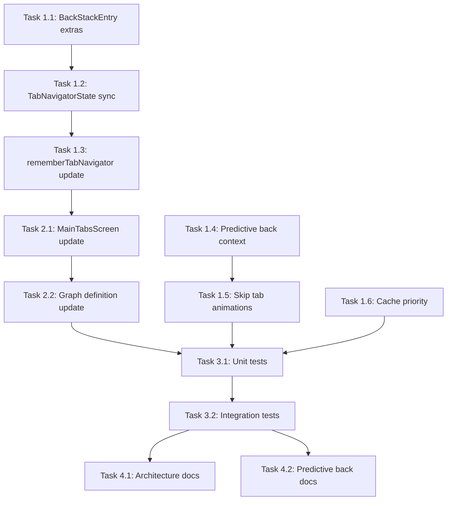

# Tabbed Navigation + Predictive Back Issues - Implementation Plan

## Overview

This document outlines the comprehensive implementation plan to fix two bugs:
1. **Visual glitch** (screen blinking) during predictive back from normal screen to tabbed navigator
2. **Tab selection not preserved** when navigating back to tabbed navigator

See `TABBED_NAV_PREDICTIVE_BACK_ANALYSIS.md` for detailed root cause analysis.

---

## Solution Strategy

We need a multi-pronged approach:

1. **Store tab state in navigation state** - Associate tab selection with the parent BackStackEntry
2. **Skip tab animations during predictive back** - Avoid fadeIn animation when returning from gesture
3. **Improve state restoration** - Fix the Saver to restore state correctly without flash
4. **Keep MainTabsScreen in composition** - Leverage caching to prevent fresh recomposition

---

## Implementation Tasks

### Phase 1: Core Library Changes

#### Task 1.1: Add Tab State to BackStackEntry Extras

**File:** `quo-vadis-core/src/commonMain/kotlin/com/jermey/quo/vadis/core/navigation/core/BackStackEntry.kt`

**Changes:**
- Add support for storing arbitrary extras in `BackStackEntry`
- These extras will persist across navigation and be restored

```kotlin
data class BackStackEntry(
    val id: String,
    val destination: Destination,
    val arguments: Map<String, Any?> = emptyMap(),
    val extras: MutableMap<String, Any?> = mutableMapOf()  // NEW
)

// Extension functions for typed access
fun BackStackEntry.getExtra(key: String): Any? = extras[key]
fun BackStackEntry.setExtra(key: String, value: Any?) { extras[key] = value }

// Tab-specific extras
const val EXTRA_SELECTED_TAB_ROUTE = "quo_vadis_selected_tab_route"
```

**Priority:** HIGH
**Effort:** 2 hours

---

#### Task 1.2: Modify TabNavigatorState to Sync with BackStackEntry

**File:** `quo-vadis-core/src/commonMain/kotlin/com/jermey/quo/vadis/core/navigation/core/TabNavigatorState.kt`

**Changes:**
- Accept optional `BackStackEntry` reference
- Sync selected tab to entry extras on selection change
- Restore from entry extras on initialization

```kotlin
class TabNavigatorState(
    val config: TabNavigatorConfig,
    private val parentEntry: BackStackEntry? = null  // NEW
) {
    private val _selectedTab = MutableStateFlow(
        // Restore from entry extras if available
        parentEntry?.getExtra(EXTRA_SELECTED_TAB_ROUTE)
            ?.let { route -> config.allTabs.find { it.route == route } }
            ?: config.initialTab
    )
    
    fun selectTab(tab: TabDefinition) {
        _selectedTab.value = tab
        // Sync to parent entry extras
        parentEntry?.setExtra(EXTRA_SELECTED_TAB_ROUTE, tab.route)
    }
}
```

**Priority:** HIGH
**Effort:** 2 hours

---

#### Task 1.3: Update rememberTabNavigator to Use BackStackEntry

**File:** `quo-vadis-core/src/commonMain/kotlin/com/jermey/quo/vadis/core/navigation/compose/RememberTabNavigation.kt`

**Changes:**
- Accept current `BackStackEntry` from parent navigator
- Pass entry to `TabNavigatorState` for state sync
- Remove or simplify the Saver (state now lives in entry)

```kotlin
@Composable
fun rememberTabNavigator(
    config: TabNavigatorConfig,
    parentNavigator: Navigator,
    parentEntry: BackStackEntry? = null  // NEW - optional for backward compat
): TabNavigatorState {
    // Use entry-based state if available
    val state = remember(config, parentEntry?.id) {
        TabNavigatorState(config, parentEntry)
    }
    
    // Still use rememberSaveable as backup for process death
    // But primary state is in entry extras
    
    return state
}
```

**Priority:** HIGH
**Effort:** 1 hour

---

#### Task 1.4: Add Predictive Back Context Detection

**File:** `quo-vadis-core/src/commonMain/kotlin/com/jermey/quo/vadis/core/navigation/compose/PredictiveBackNavigation.kt`

**Changes:**
- Expose a CompositionLocal to indicate predictive back is in progress
- Allows child composables to skip animations during gesture

```kotlin
val LocalPredictiveBackInProgress = staticCompositionLocalOf { false }

// In GraphNavHostContent, wrap content:
CompositionLocalProvider(
    LocalPredictiveBackInProgress provides isPredictiveGesture
) {
    // Render content
}
```

**Priority:** MEDIUM
**Effort:** 1 hour

---

#### Task 1.5: Skip Tab Animations During Predictive Back

**File:** `quo-vadis-core/src/commonMain/kotlin/com/jermey/quo/vadis/core/navigation/compose/TabNavigationContainer.kt`

**Changes:**
- Check `LocalPredictiveBackInProgress`
- Use `TabTransitionSpec.None` when returning from predictive back
- Prevent fadeIn animation that causes blink

```kotlin
@Composable
internal fun TabContent(
    visible: Boolean,
    transitionSpec: TabTransitionSpec,
    content: @Composable () -> Unit
) {
    val isPredictiveBack = LocalPredictiveBackInProgress.current
    
    // Skip animation during predictive back to prevent blink
    val effectiveTransition = if (isPredictiveBack) {
        TabTransitionSpec.None
    } else {
        transitionSpec
    }
    
    AnimatedVisibility(
        visible = visible,
        enter = effectiveTransition.enter,
        exit = effectiveTransition.exit
    ) {
        content()
    }
}
```

**Priority:** HIGH
**Effort:** 1 hour

---

#### Task 1.6: Ensure MainTabsScreen Stays in Cache

**File:** `quo-vadis-core/src/commonMain/kotlin/com/jermey/quo/vadis/core/navigation/compose/ComposableCache.kt`

**Changes:**
- Ensure entries with nested navigators have higher priority
- OR increase default `maxCacheSize` to 5
- Consider adding `priority` field to lock certain entries permanently

```kotlin
class ComposableCache(
    private val maxCacheSize: Int = 5  // Increased from 3
) {
    private val priorityEntries = mutableStateSetOf<String>()  // NEW
    
    fun setPriority(entryId: String, isPriority: Boolean) {
        if (isPriority) priorityEntries.add(entryId)
        else priorityEntries.remove(entryId)
    }
    
    // During eviction, skip priority entries
    private fun evictOldestIfNeeded(...) {
        val candidates = accessTimeMap.entries
            .filter { it.key !in lockedEntries && it.key !in priorityEntries }
            .minByOrNull { it.value }
        // ...
    }
}
```

**Priority:** LOW
**Effort:** 1 hour

---

### Phase 2: Demo App Changes

#### Task 2.1: Pass BackStackEntry to MainTabsScreen

**File:** `composeApp/src/commonMain/kotlin/com/jermey/navplayground/demo/ui/screens/MainTabsUI.kt`

**Changes:**
- Accept parent `BackStackEntry` as parameter
- Pass to `rememberTabNavigator`

```kotlin
@Composable
fun MainTabsScreen(
    parentNavigator: Navigator,
    parentEntry: BackStackEntry  // NEW
) {
    val tabState = rememberTabNavigator(
        config = MainTabsConfig,
        parentNavigator = parentNavigator,
        parentEntry = parentEntry  // NEW
    )
    // ...
}
```

**Priority:** HIGH
**Effort:** 30 minutes

---

#### Task 2.2: Update Graph Definition to Pass Entry

**File:** `composeApp/src/commonMain/kotlin/com/jermey/navplayground/demo/graphs/AppRootGraph.kt`

**Changes:**
- Access current `BackStackEntry` in destination builder
- Pass to `MainTabsScreen`

```kotlin
navigationGraph("app-root") {
    startDestination(AppDestination.MainTabs)
    
    destination(AppDestination.MainTabs) { entry, navigator ->
        MainTabsScreen(
            parentNavigator = navigator,
            parentEntry = entry  // NEW - entry is already available
        )
    }
    // ...
}
```

**Priority:** HIGH
**Effort:** 30 minutes

---

### Phase 3: Testing

#### Task 3.1: Add Unit Tests for Tab State Persistence

**File:** `quo-vadis-core/src/commonTest/kotlin/.../TabStatePersistenceTest.kt` (NEW)

**Test Cases:**
- Tab selection is stored in BackStackEntry extras
- Tab selection is restored when entry is re-rendered
- Tab selection survives navigation away and back
- Tab selection works with predictive back

**Priority:** MEDIUM
**Effort:** 2 hours

---

#### Task 3.2: Add Integration Tests for Predictive Back + Tabs

**File:** `composeApp/src/commonTest/kotlin/.../PredictiveBackTabsTest.kt` (NEW)

**Test Cases:**
- Navigate to Explore tab → Detail → Back → Explore tab preserved
- Predictive back gesture → No visual glitch (manual verification)
- Predictive back cancel → Returns to Detail correctly

**Priority:** MEDIUM
**Effort:** 2 hours

---

### Phase 4: Documentation

#### Task 4.1: Update Architecture Documentation

**File:** `quo-vadis-core/docs/ARCHITECTURE.md`

**Changes:**
- Document BackStackEntry extras pattern
- Document tab state persistence mechanism
- Update diagrams to show state flow

**Priority:** LOW
**Effort:** 1 hour

---

#### Task 4.2: Update Predictive Back Documentation

**File:** `quo-vadis-core/docs/MULTIPLATFORM_PREDICTIVE_BACK.md`

**Changes:**
- Document `LocalPredictiveBackInProgress` CompositionLocal
- Add section on nested navigators and tabs
- Document animation skipping behavior

**Priority:** LOW
**Effort:** 1 hour

---

## Implementation Order



**Critical Path:**
1. Task 1.1 → Task 1.2 → Task 1.3 → Task 2.1 → Task 2.2 (Tab preservation fix)
2. Task 1.4 → Task 1.5 (Visual glitch fix)

---

## Risk Assessment

| Risk | Impact | Mitigation |
|------|--------|------------|
| Breaking existing tab behavior | HIGH | Backward-compatible API, optional entry parameter |
| State not persisting across process death | MEDIUM | Keep rememberSaveable as backup mechanism |
| Performance impact from extras | LOW | Map operations are O(1), minimal overhead |
| Predictive back context not propagating | MEDIUM | Test on all platforms, add fallback |

---

## Rollback Plan

If issues arise after implementation:
1. Make `parentEntry` parameter optional with `null` default
2. If `null`, fall back to existing `rememberSaveable` behavior
3. Can be rolled back by not passing entry in graph definitions

---

## Estimated Total Effort

| Phase | Effort |
|-------|--------|
| Phase 1: Core Library | 8 hours |
| Phase 2: Demo App | 1 hour |
| Phase 3: Testing | 4 hours |
| Phase 4: Documentation | 2 hours |
| **Total** | **15 hours** |

---

## Success Criteria

1. ✅ Navigate: Home tab → Explore tab → Detail → Back → Explore tab preserved
2. ✅ No visual glitch/blink during predictive back to tabbed screen
3. ✅ All existing tests pass
4. ✅ Works on Android, iOS, Desktop, Web
5. ✅ Documentation updated

---

## Alternative Approaches Considered

### Approach A: Hoist Tab State Higher (Not Chosen)
- Move tab state to a ViewModel or singleton
- **Rejected:** Breaks encapsulation, harder to test, conflicts with navigation-driven architecture

### Approach B: Keep Both Screens in Composition (Not Chosen)
- Use overlay/z-index instead of navigation stack
- **Rejected:** Breaks navigation model, complicates back stack, memory overhead

### Approach C: Custom Tab BackStack Entry Type (Not Chosen)
- Create special destination subclass for tabs
- **Rejected:** Too invasive, breaks type safety, hard to maintain

### Chosen Approach: BackStackEntry Extras + Animation Skipping
- Minimal invasive changes
- Backward compatible
- Follows existing patterns in navigation libraries (Jetpack Navigation uses SavedStateHandle similarly)
- Clear separation of concerns
