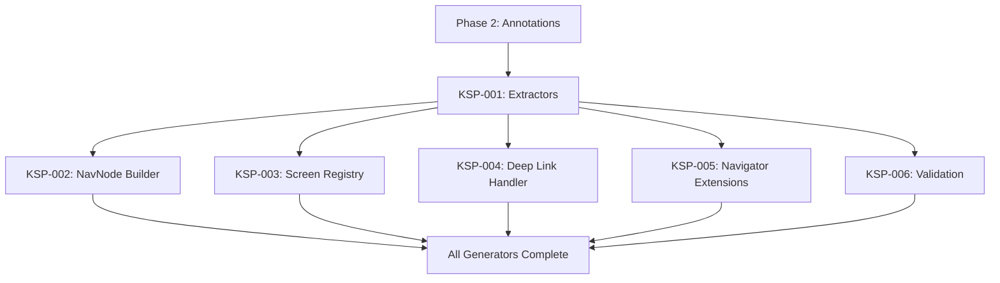

# Phase 3: KSP Processor Rewrite - Summary

## Phase Overview

Phase 3 focuses on completely rewriting the KSP (Kotlin Symbol Processing) processor for the Quo Vadis navigation library. This phase implements the code generation layer that transforms annotation metadata into runtime navigation infrastructure, including NavNode builders, screen registries, deep link handlers, and navigator extensions.

### Objectives

1. **Create extraction layer** - Build extractors that parse annotations into strongly-typed intermediate models
2. **Generate NavNode builders** - Produce type-safe builder functions for navigation containers (`@Stack`, `@Tab`, `@Pane`)
3. **Generate screen registry** - Create a central dispatch mechanism mapping destinations to composable screens
4. **Generate deep link handler** - Enable URI-based navigation with pattern matching and parameter extraction
5. **Generate navigator extensions** - Provide ergonomic convenience methods for common navigation actions
6. **Implement validation** - Catch configuration errors at compile time with clear, actionable messages

---

## Task Summary

### KSP-001: Create Annotation Extractors

| Property | Value |
|----------|-------|
| **Complexity** | Medium |
| **Estimated Time** | 2-3 days |
| **Blocked By** | Phase 3 Annotations (ANN-001 through ANN-005) |
| **Blocks** | KSP-002, KSP-003, KSP-004, KSP-005 |

**Description**: Creates the extraction layer—a set of extractor classes that parse each annotation type into strongly-typed intermediate models. These models serve as the foundation for all code generation in subsequent KSP tasks.

**Key Components**:
- `DestinationExtractor` - Extracts `@Destination` annotations
- `StackExtractor` - Extracts `@Stack` annotations
- `TabExtractor` - Extracts `@Tab`/`@TabItem` annotations
- `PaneExtractor` - Extracts `@Pane`/`@PaneItem` annotations
- `ScreenExtractor` - Extracts `@Screen` annotations

**Output Models**:
- `DestinationInfo`, `ParamInfo`, `StackInfo`, `TabInfo`, `TabItemInfo`, `PaneInfo`, `PaneItemInfo`, `ScreenInfo`

---

### KSP-002: Create NavNode Builder Generator

| Property | Value |
|----------|-------|
| **Complexity** | High |
| **Estimated Time** | 4-5 days |
| **Blocked By** | KSP-001 |
| **Blocks** | KSP-003, KSP-004 |

**Description**: Implements the `NavNodeBuilderGenerator`—the core code generator that transforms extracted annotation metadata into `build{Name}NavNode()` functions. These functions construct the initial NavNode tree structure for navigation containers.

**Generated Output**:
- `HomeDestinationNavNodeBuilder.kt` - For `@Stack` containers
- `MainTabsNavNodeBuilder.kt` - For `@Tab` containers
- `CatalogPaneNavNodeBuilder.kt` - For `@Pane` containers

**Key Features**:
- Generates `StackNode`, `TabNode`, and `PaneNode` builders
- Handles start destination resolution
- Supports nested container references
- Provides default parameters for keys and parent keys

---

### KSP-003: Create Screen Registry Generator

| Property | Value |
|----------|-------|
| **Complexity** | Medium |
| **Estimated Time** | 2-3 days |
| **Blocked By** | KSP-001 |
| **Blocks** | None |

**Description**: Creates the `ScreenRegistryGenerator` that produces `GeneratedScreenRegistry.kt`, mapping destination types to their corresponding composable screen functions.

**Generated Output**:
- `GeneratedScreenRegistry.kt` - Implements `ScreenRegistry` interface

**Key Features**:
- `Content()` composable with `when` expression dispatching to `@Screen` functions
- `hasContent()` method for runtime destination validation
- Handles three function signatures:
  - Simple (Navigator only)
  - With destination parameter
  - With shared transition scopes (`SharedTransitionScope`, `AnimatedVisibilityScope`)

---

### KSP-004: Create Deep Link Handler Generator

| Property | Value |
|----------|-------|
| **Complexity** | High |
| **Estimated Time** | 3-4 days |
| **Blocked By** | KSP-001 |
| **Blocks** | None |

**Description**: Creates a KSP generator that produces `GeneratedDeepLinkHandler.kt` for parsing deep link URIs into destination instances.

**Generated Output**:
- `GeneratedDeepLinkHandler.kt` - Implements `DeepLinkHandler` interface
- `RoutePattern` data class for regex-based matching
- `DeepLinkResult` sealed class for match results

**Key Features**:
- `handleDeepLink(uri)` - Matches URIs to route patterns
- `createDeepLinkUri(destination)` - Generates URIs from destinations
- Supports path parameters (e.g., `{id}`, `{userId}`)
- Pattern to regex conversion with capture groups

---

### KSP-005: Create Navigator Extensions Generator

| Property | Value |
|----------|-------|
| **Complexity** | Low |
| **Estimated Time** | 1 day |
| **Blocked By** | KSP-001 |
| **Blocks** | None |

**Description**: Implements the `NavigatorExtGenerator`—an optional code generator that creates convenience extension functions for the `Navigator` class.

**Generated Output**:
- `NavigatorExtensions.kt` - Extension functions for `Navigator`

**Key Features**:
- `to{Destination}()` methods for each destination
- `switchTo{Tab}Tab()` methods for tab switching
- `switchTo{Pane}Pane()` methods for pane switching
- IDE-friendly discoverability via autocomplete

---

### KSP-006: Validation and Error Reporting

| Property | Value |
|----------|-------|
| **Complexity** | Medium |
| **Estimated Time** | 2-3 days |
| **Blocked By** | KSP-001 |
| **Blocks** | None |

**Description**: Implements the validation layer—a comprehensive validation system that checks annotation usage correctness and reports clear, actionable error messages.

**Validation Categories**:
1. **Structural** - Orphan destinations, missing containers, invalid start destinations
2. **Route** - Parameter mismatches, duplicate routes, invalid syntax
3. **Reference** - Invalid root graphs, missing/duplicate screen bindings
4. **Type** - Non-sealed containers, non-data destinations

**Key Features**:
- Compile-time error detection
- Source location in error messages
- Actionable suggestions for fixes
- Warning vs error severity levels

---

## Key Components/Features to be Implemented

### Models (`quo-vadis-ksp/src/main/kotlin/.../models/`)
| File | Description |
|------|-------------|
| `DestinationInfo.kt` | Destination metadata model |
| `ParamInfo.kt` | Constructor parameter metadata |
| `StackInfo.kt` | Stack container metadata |
| `TabInfo.kt` | Tab container metadata |
| `TabItemInfo.kt` | Tab item metadata |
| `PaneInfo.kt` | Pane container metadata |
| `PaneItemInfo.kt` | Pane item metadata |
| `ScreenInfo.kt` | Screen binding metadata |

### Extractors (`quo-vadis-ksp/src/main/kotlin/.../extractors/`)
| File | Description |
|------|-------------|
| `DestinationExtractor.kt` | Parses `@Destination` annotations |
| `StackExtractor.kt` | Parses `@Stack` annotations |
| `TabExtractor.kt` | Parses `@Tab`/`@TabItem` annotations |
| `PaneExtractor.kt` | Parses `@Pane`/`@PaneItem` annotations |
| `ScreenExtractor.kt` | Parses `@Screen` annotations |

### Generators (`quo-vadis-ksp/src/main/kotlin/.../generators/`)
| File | Description |
|------|-------------|
| `NavNodeBuilderGenerator.kt` | Generates NavNode builder functions |
| `ScreenRegistryGenerator.kt` | Generates screen registry object |
| `DeepLinkHandlerGenerator.kt` | Generates deep link handler |
| `NavigatorExtGenerator.kt` | Generates navigator extensions |

### Validation (`quo-vadis-ksp/src/main/kotlin/.../validation/`)
| File | Description |
|------|-------------|
| `ValidationEngine.kt` | Comprehensive validation system |

### Core Interfaces (to be created/modified in `quo-vadis-core`)
| File | Description |
|------|-------------|
| `ScreenRegistry.kt` | Interface for screen dispatch |
| `DeepLinkHandler.kt` | Interface for deep link handling |

---

## Dependencies on Other Phases

### Depends On

| Phase | Tasks | Reason |
|-------|-------|--------|
| **Phase 2: Annotations** | ANN-001 through ANN-005 | KSP extractors parse these annotations |
| **Phase 1: Core** | CORE-001 (NavNode hierarchy) | Generated builders create NavNode instances |
| **Phase 1: Core** | CORE-003 (Navigator refactor) | Extensions call Navigator methods |

### Depended On By

| Phase | Tasks | Reason |
|-------|-------|--------|
| **Phase 5: Migration** | All migration tasks | Migration uses generated code |

---

## File References

### Files to Create

```
quo-vadis-ksp/src/main/kotlin/com/jermey/quo/vadis/ksp/
├── extractors/
│   ├── DestinationExtractor.kt
│   ├── StackExtractor.kt
│   ├── TabExtractor.kt
│   ├── PaneExtractor.kt
│   └── ScreenExtractor.kt
├── models/
│   ├── DestinationInfo.kt
│   ├── ParamInfo.kt
│   ├── StackInfo.kt
│   ├── TabInfo.kt
│   ├── PaneInfo.kt
│   └── ScreenInfo.kt
├── generators/
│   ├── NavNodeBuilderGenerator.kt
│   ├── ScreenRegistryGenerator.kt
│   ├── DeepLinkHandlerGenerator.kt
│   └── NavigatorExtGenerator.kt
├── validation/
│   └── ValidationEngine.kt
└── QuoVadisClassNames.kt
```

### Files to Modify

| File | Modifications |
|------|---------------|
| `QuoVadisSymbolProcessor.kt` | Wire extractors, generators, and validation engine |

### Generated Output Files

```
build/generated/ksp/commonMain/kotlin/{package}/generated/
├── {Name}NavNodeBuilder.kt          # Per @Stack, @Tab, @Pane
├── GeneratedScreenRegistry.kt       # Single registry object
├── GeneratedDeepLinkHandler.kt      # Single handler object
└── NavigatorExtensions.kt           # All extensions in one file
```

---

## Estimated Complexity/Effort

| Task | Complexity | Time Estimate |
|------|------------|---------------|
| KSP-001: Annotation Extractors | Medium | 2-3 days |
| KSP-002: NavNode Builder Generator | High | 4-5 days |
| KSP-003: Screen Registry Generator | Medium | 2-3 days |
| KSP-004: Deep Link Handler Generator | High | 3-4 days |
| KSP-005: Navigator Extensions Generator | Low | 1 day |
| KSP-006: Validation and Error Reporting | Medium | 2-3 days |

**Total Phase Estimate**: 14-19 days

### Complexity Breakdown

- **High Complexity** (KSP-002, KSP-004): Core generation logic with complex output structures, cross-references between containers, regex pattern matching
- **Medium Complexity** (KSP-001, KSP-003, KSP-006): Annotation parsing, function signature detection, comprehensive validation rules
- **Low Complexity** (KSP-005): Simple extension generation with minimal logic

---

## Implementation Order



**Recommended Sequence**:
1. **KSP-001** (Extractors) - Foundation for all other tasks
2. **KSP-006** (Validation) - Can run in parallel with generators
3. **KSP-002** (NavNode Builder) - Core generator
4. **KSP-003** (Screen Registry) - Parallel with KSP-002
5. **KSP-004** (Deep Link Handler) - Parallel with KSP-002/KSP-003
6. **KSP-005** (Navigator Extensions) - Lowest priority, can be last

---

## References

- [INDEX.md](../INDEX.md) - Phase Overview Index
- [Phase 1: Core](../phase1-core/) - NavNode hierarchy and Navigator API
- [Phase 2: Annotations](../phase4-annotations/) - Annotation definitions
- [KSP Documentation](https://kotlinlang.org/docs/ksp-overview.html) - Kotlin Symbol Processing
- [KotlinPoet](https://square.github.io/kotlinpoet/) - Code generation library
