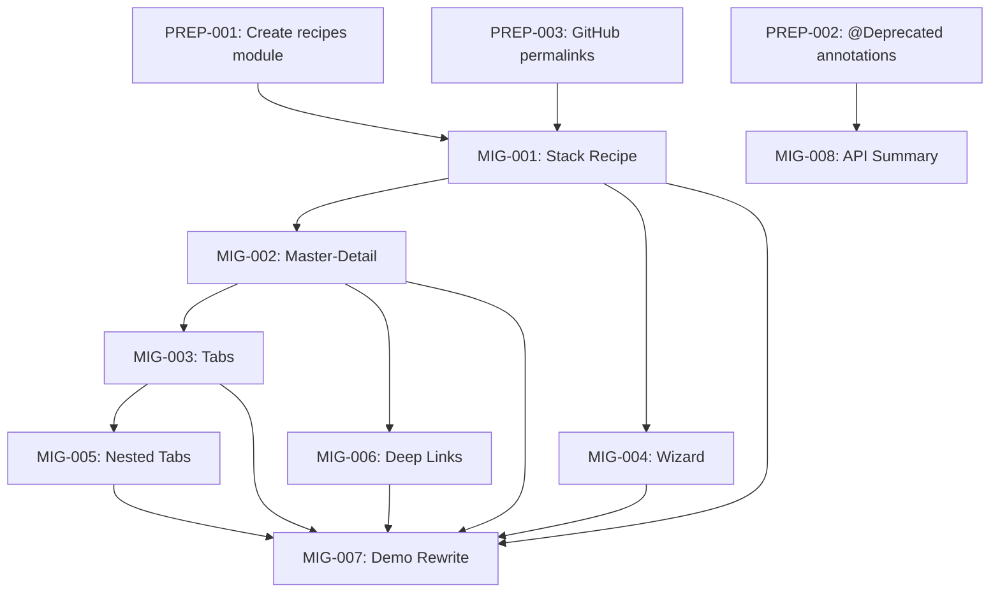

# Phase 5: Migration - Summary (REFINED)

## Phase Overview

| Attribute | Value |
|-----------|-------|
| **Phase** | 5 |
| **Focus** | Recipes Module, API Deprecation & Demo Migration |
| **Total Tasks** | 10 |
| **Total Estimated Time** | 14-17 days |
| **Dependencies** | Phases 1-4 complete |

## Objectives

Phase 5 provides comprehensive migration guidance and LLM-consumable documentation for transitioning from the old Quo Vadis navigation API to the new NavNode architecture. This phase creates:

1. **`quo-vadis-recipes` module** - Self-contained, pattern-based examples for LLM-assisted integration
2. **`@Deprecated` annotations** - All legacy APIs marked with `replaceWith` guidance
3. **GitHub permalink references** - All "migrating from" code points to stable main branch URLs
4. **Demo app migration** - Comprehensive reference implementation
5. **Quick-reference documentation** - API change summary

## Key Changes from Original Plan

| Aspect | Original | Refined |
|--------|----------|---------|
| **Example Location** | `docs/migration-examples/*.md` | `quo-vadis-recipes/` module (runnable code) |
| **Legacy API Handling** | Documentation only | `@Deprecated` annotations with `replaceWith` |
| **Code References** | Inline code blocks | GitHub permalinks to main branch |
| **LLM Support** | None | Pattern-based packages, rich KDoc for discoverability |
| **Task Count** | 7 | 11 (3 new preparatory tasks + 1 new recipe) |

---

## Task Index

| ID | Task | File | Complexity | Est. Time |
|----|------|------|------------|-----------|
| PREP-001 | Create quo-vadis-recipes Module | [PREP-001](./PREP-001-recipes-module.md) | Medium | 1.5 days |
| PREP-002 | Add @Deprecated Annotations | [PREP-002](./PREP-002-deprecated-annotations.md) | Medium | 2 days |
| PREP-003 | GitHub Permalink Reference | [PREP-003](./PREP-003-permalink-reference.md) | Low | 0.5 days |
| MIG-001 | Simple Stack Navigation Recipe | [MIG-001](./MIG-001-simple-stack-example.md) | Low | 1 day |
| MIG-002 | Master-Detail Pattern Recipe | [MIG-002](./MIG-002-master-detail-example.md) | Medium | 1.5 days |
| MIG-003 | Tabbed Navigation Recipe | [MIG-003](./MIG-003-tabbed-navigation-example.md) | Medium | 2 days |
| MIG-004 | Process/Wizard Flow Recipe | [MIG-004](./MIG-004-process-flow-example.md) | Low | 1 day |
| MIG-005 | Nested Tabs + Detail Recipe | [MIG-005](./MIG-005-nested-tabs-detail-example.md) | Medium | 1.5 days |
| MIG-006 | Deep Linking Recipe | [MIG-006](./MIG-006-deep-linking-recipe.md) | Medium | 1 day |
| MIG-007 | Demo App Rewrite | [MIG-007](./MIG-007-demo-app-rewrite.md) | High | 3-4 days |
| MIG-008 | API Change Summary Document | [MIG-008](./MIG-008-api-change-summary.md) | Low | 0.5 days |

---

## Task Summary

### PREP-001: Create quo-vadis-recipes Module

| Attribute | Value |
|-----------|-------|
| **Complexity** | Medium |
| **Estimated Time** | 1.5 days |
| **Dependencies** | None (can start immediately) |
| **Output** | `quo-vadis-recipes/` module skeleton |

**Purpose**: Create new module for LLM-consumable, pattern-based navigation examples.

**Deliverables**:
1. `quo-vadis-recipes/build.gradle.kts` - Multiplatform module configuration
2. `settings.gradle.kts` update - Include new module
3. Package structure skeleton:
   ```
   quo-vadis-recipes/src/commonMain/kotlin/com/jermey/quo/vadis/recipes/
   ├── README.md              # LLM-readable index
   ├── stack/                 # Linear stack patterns
   ├── tabs/                  # Tabbed navigation patterns
   ├── masterdetail/          # Master-detail patterns
   ├── wizard/                # Process/wizard patterns
   ├── deeplink/              # Deep linking patterns
   ├── pane/                  # Adaptive layout patterns
   └── shared/                # Common utilities
   ```

**Dependencies** (module level):
- `quo-vadis-core` - Navigation library
- `quo-vadis-annotations` - New annotations
- Compose dependencies (material3, foundation, ui)

**Note**: This module is NOT published. It exists as documentation and LLM training material.

---

### PREP-002: Add @Deprecated Annotations to Legacy APIs

| Attribute | Value |
|-----------|-------|
| **Complexity** | Medium |
| **Estimated Time** | 2 days |
| **Dependencies** | Phase 4 annotations defined |
| **Output** | All legacy APIs marked `@Deprecated` |

**Purpose**: Mark all old APIs for deprecation with clear migration paths.

**GitHub Reference Base URL**: `https://github.com/jermeyyy/quo-vadis/blob/main/`

**APIs to Deprecate** (with `replaceWith`):

#### Core APIs (`quo-vadis-core/src/commonMain/.../core/`)

| API | File | Replacement |
|-----|------|-------------|
| `NavigationGraph` | [NavigationGraph.kt](https://github.com/jermeyyy/quo-vadis/blob/main/quo-vadis-core/src/commonMain/kotlin/com/jermey/quo/vadis/core/navigation/core/NavigationGraph.kt) | `NavNode` hierarchy |
| `NavigationGraphBuilder` | Same file | KSP-generated builders |
| `navigationGraph()` | Same file | `@Stack`, `@Tab`, `@Pane` annotations |
| `BackStack` | [BackStack.kt](https://github.com/jermeyyy/quo-vadis/blob/main/quo-vadis-core/src/commonMain/kotlin/com/jermey/quo/vadis/core/navigation/core/BackStack.kt) | `TreeMutator` operations |
| `TypedDestination<T>` | [Destination.kt](https://github.com/jermeyyy/quo-vadis/blob/main/quo-vadis-core/src/commonMain/kotlin/com/jermey/quo/vadis/core/navigation/core/Destination.kt) | Route templates `{param}` |
| `TabNavigatorConfig` | [TabDefinition.kt](https://github.com/jermeyyy/quo-vadis/blob/main/quo-vadis-core/src/commonMain/kotlin/com/jermey/quo/vadis/core/navigation/core/TabDefinition.kt) | `@Tab` + `@TabItem` annotations |

#### Compose APIs (`quo-vadis-core/src/commonMain/.../compose/`)

| API | File | Replacement |
|-----|------|-------------|
| `NavHost` | [NavHost.kt](https://github.com/jermeyyy/quo-vadis/blob/main/quo-vadis-core/src/commonMain/kotlin/com/jermey/quo/vadis/core/navigation/compose/NavHost.kt) | `QuoVadisHost` |
| `GraphNavHost` | [GraphNavHost.kt](https://github.com/jermeyyy/quo-vadis/blob/main/quo-vadis-core/src/commonMain/kotlin/com/jermey/quo/vadis/core/navigation/compose/GraphNavHost.kt) | `QuoVadisHost` |
| `TabbedNavHost` | [TabbedNavHost.kt](https://github.com/jermeyyy/quo-vadis/blob/main/quo-vadis-core/src/commonMain/kotlin/com/jermey/quo/vadis/core/navigation/compose/TabbedNavHost.kt) | `QuoVadisHost` + `tabWrapper` |
| `rememberTabNavigator` | Same file | `rememberNavigator(navTree)` |

#### Annotation APIs (`quo-vadis-annotations/`)

| API | File | Replacement |
|-----|------|-------------|
| `@Graph` | [Annotations.kt](https://github.com/jermeyyy/quo-vadis/blob/main/quo-vadis-annotations/src/commonMain/kotlin/com/jermey/quo/vadis/annotations/Annotations.kt) | `@Stack`, `@Tab`, `@Pane` |
| `@Route` | Same file | `@Destination` |
| `@Argument` | Same file | Route templates |
| `@Content` | Same file | `@Screen` |

**Deprecation Pattern**:
```kotlin
@Deprecated(
    message = "Replaced by NavNode-based architecture. See migration guide.",
    replaceWith = ReplaceWith(
        expression = "QuoVadisHost(navigator, screenRegistry)",
        imports = ["com.jermey.quo.vadis.core.navigation.compose.QuoVadisHost"]
    ),
    level = DeprecationLevel.WARNING
)
```

---

### PREP-003: Create GitHub Permalink Reference Document

| Attribute | Value |
|-----------|-------|
| **Complexity** | Low |
| **Estimated Time** | 0.5 days |
| **Dependencies** | None |
| **Output** | `docs/migration-examples/LEGACY_API_REFERENCE.md` |

**Purpose**: Central document linking all legacy APIs to their main branch locations.

**Content Structure**:
```markdown
# Legacy API Reference (Main Branch)

## Core Navigation
- [Destination.kt](https://github.com/jermeyyy/quo-vadis/blob/main/...)
- [Navigator.kt](https://github.com/jermeyyy/quo-vadis/blob/main/...)
...

## Compose Integration
- [GraphNavHost.kt](https://github.com/jermeyyy/quo-vadis/blob/main/...)
...

## Demo App Usage
- [DemoApp.kt](https://github.com/jermeyyy/quo-vadis/blob/main/composeApp/...)
...
```

---

---

### MIG-001: Simple Stack Navigation Recipe

| Attribute | Value |
|-----------|-------|
| **Complexity** | Low |
| **Estimated Time** | 1 day |
| **Dependencies** | PREP-001 |
| **Output** | `quo-vadis-recipes/src/commonMain/.../stack/SettingsStackRecipe.kt` |

**Purpose**: Demonstrates basic linear stack navigation with NEW NavNode API.

**Recipe Structure**:
```kotlin
/**
 * # Settings Stack Recipe
 * 
 * ## Pattern: Linear Stack Navigation
 * ## Legacy Reference: https://github.com/jermeyyy/quo-vadis/blob/main/composeApp/.../destinations/SettingsDestination.kt
 * 
 * ## Migration Summary
 * OLD: @Graph("settings") → NEW: @Stack(name = "settings")
 * OLD: @Route("path") → NEW: @Destination(route = "path")
 * OLD: GraphNavHost → NEW: QuoVadisHost
 */
```

**Key Transformations** (with permalinks):
| Old API | GitHub Link | New API |
|---------|-------------|---------|
| `@Graph` | [Annotations.kt#L12](https://github.com/jermeyyy/quo-vadis/blob/main/quo-vadis-annotations/...) | `@Stack` |
| `@Route` | [Annotations.kt#L20](https://github.com/jermeyyy/quo-vadis/blob/main/quo-vadis-annotations/...) | `@Destination` |
| `@Content` | [Annotations.kt#L28](https://github.com/jermeyyy/quo-vadis/blob/main/quo-vadis-annotations/...) | `@Screen` |
| `GraphNavHost` | [GraphNavHost.kt](https://github.com/jermeyyy/quo-vadis/blob/main/quo-vadis-core/...) | `QuoVadisHost` |

---

### MIG-002: Master-Detail Pattern Recipe

| Attribute | Value |
|-----------|-------|
| **Complexity** | Medium |
| **Estimated Time** | 1.5 days |
| **Dependencies** | MIG-001 |
| **Output** | `quo-vadis-recipes/src/commonMain/.../masterdetail/ListDetailRecipe.kt` |

**Purpose**: Shows typed arguments, deep linking, and shared element transitions.

**Legacy References**:
- [MasterDetailDestination.kt](https://github.com/jermeyyy/quo-vadis/blob/main/composeApp/src/commonMain/kotlin/com/jermey/navplayground/demo/destinations/MasterDetailDestination.kt)
- [Item.kt (screens)](https://github.com/jermeyyy/quo-vadis/blob/main/composeApp/src/commonMain/kotlin/com/jermey/navplayground/demo/ui/screens/Item.kt)

**Key Transformations**:
| Old Pattern | New Pattern |
|-------------|-------------|
| `@Argument(DetailData::class)` | Route template `{param}` |
| `TypedDestination<T>` interface | Destination receives params in constructor |
| `navigate(dest, transition)` | `navigate(dest)` + `AnimationRegistry` |
| Manual `SharedTransitionLayout` | Built-in to `QuoVadisHost` |

---

### MIG-003: Tabbed Navigation Recipe

| Attribute | Value |
|-----------|-------|
| **Complexity** | Medium |
| **Estimated Time** | 2 days |
| **Dependencies** | MIG-001, MIG-002 |
| **Output** | `quo-vadis-recipes/src/commonMain/.../tabs/BottomTabsRecipe.kt` |

**Purpose**: Demonstrates `@Tab` + `@TabItem` with user-controlled `tabWrapper`.

**Legacy References**:
- [TabbedNavHost.kt](https://github.com/jermeyyy/quo-vadis/blob/main/quo-vadis-core/src/commonMain/kotlin/com/jermey/quo/vadis/core/navigation/compose/TabbedNavHost.kt)
- [TabDefinition.kt](https://github.com/jermeyyy/quo-vadis/blob/main/quo-vadis-core/src/commonMain/kotlin/com/jermey/quo/vadis/core/navigation/core/TabDefinition.kt)
- [MainTabsDestination.kt](https://github.com/jermeyyy/quo-vadis/blob/main/composeApp/src/commonMain/kotlin/com/jermey/navplayground/demo/destinations/MainTabsDestination.kt)

**Key Transformations**:
| Old Pattern | New Pattern |
|-------------|-------------|
| `TabbedNavigatorConfig` object | `@Tab` + `@TabItem` annotations |
| `TabbedNavHost` | `QuoVadisHost` + `tabWrapper` |
| `rememberTabNavigator()` | State in NavNode tree |
| `tabState.switchTab(index)` | `navigator.switchTab(tab)` |
| Tab UI inside TabbedNavHost | User-controlled via `tabWrapper` |

---

### MIG-004: Process/Wizard Flow Recipe

| Attribute | Value |
|-----------|-------|
| **Complexity** | Low |
| **Estimated Time** | 1 day |
| **Dependencies** | MIG-001 |
| **Output** | `quo-vadis-recipes/src/commonMain/.../wizard/` (2 files) |

**Purpose**: Shows multi-step flows with conditional branching and stack clearing.

**Recipe Files**:
- `LinearWizardRecipe.kt` - Simple sequential flow
- `BranchingWizardRecipe.kt` - Conditional routing based on user choices

**Legacy References**:
- [ProcessScreens.kt](https://github.com/jermeyyy/quo-vadis/blob/main/composeApp/src/commonMain/kotlin/com/jermey/navplayground/demo/ui/screens/ProcessScreens.kt)
- [OnboardingDestination.kt](https://github.com/jermeyyy/quo-vadis/blob/main/composeApp/src/commonMain/kotlin/com/jermey/navplayground/demo/destinations/OnboardingDestination.kt)

**Key Transformations**:
| Old Pattern | New Pattern |
|-------------|-------------|
| `navigateAndClearTo(dest, route, inclusive)` | `navigateAndClear(dest, clearUpTo::class, inclusive)` |
| `popTo(route)` string-based | `popTo(DestClass)` type-safe |
| Manual branching logic | Same, but type-safe destinations |
| N/A | New `navigator.exitFlow(DestClass)` convenience |

---

### MIG-005: Nested Tabs + Detail Recipe

| Attribute | Value |
|-----------|-------|
| **Complexity** | Medium |
| **Estimated Time** | 1.5 days |
| **Dependencies** | MIG-002, MIG-003 |
| **Output** | `quo-vadis-recipes/src/commonMain/.../tabs/TabWithNestedStackRecipe.kt` |

**Purpose**: Complex hierarchies where detail screens cover the tab bar.

**Legacy References**:
- [DemoApp.kt](https://github.com/jermeyyy/quo-vadis/blob/main/composeApp/src/commonMain/kotlin/com/jermey/navplayground/demo/DemoApp.kt) - Nested NavHost pattern
- [TabsScreens.kt](https://github.com/jermeyyy/quo-vadis/blob/main/composeApp/src/commonMain/kotlin/com/jermey/navplayground/demo/ui/screens/TabsScreens.kt)

**Key Transformations**:
| Old Pattern | New Pattern |
|-------------|-------------|
| Multiple nested `NavHost` | Single unified `QuoVadisHost` |
| Parent navigator passing | Single navigator for all |
| Manual z-index management | Automatic z-ordering via flattening |
| Shared elements limited to host | Cross-boundary shared elements |
| Per-host predictive back | Unified speculative pop |

---

### MIG-006: Deep Linking Recipe

| Attribute | Value |
|-----------|-------|
| **Complexity** | Medium |
| **Estimated Time** | 1 day |
| **Dependencies** | MIG-001, MIG-002 |
| **Output** | `quo-vadis-recipes/src/commonMain/.../deeplink/` |

**Purpose**: URI-based navigation and path reconstruction (NEW task).

**Recipe Files**:
- `BasicDeepLinkRecipe.kt` - Simple URI handling
- `NestedDeepLinkRecipe.kt` - Deep link to nested screens
- `DeepLinkDestinations.kt` - Shared destination definitions

**Legacy References**:
- [DeepLink.kt](https://github.com/jermeyyy/quo-vadis/blob/main/quo-vadis-core/src/commonMain/kotlin/com/jermey/quo/vadis/core/navigation/core/DeepLink.kt)
- [DeepLinkDemoScreen.kt](https://github.com/jermeyyy/quo-vadis/blob/main/composeApp/src/commonMain/kotlin/com/jermey/navplayground/demo/ui/screens/DeepLinkDemoScreen.kt)

**Key Transformations**:
| Old Pattern | New Pattern |
|-------------|-------------|
| `DeepLinkHandler` interface | KSP-generated handlers |
| Manual route parsing | Automatic from `@Destination(route)` |
| Flat route matching | Tree path reconstruction |

---

### MIG-007: Demo App Rewrite

| Attribute | Value |
|-----------|-------|
| **Complexity** | High |
| **Estimated Time** | 3-4 days |
| **Dependencies** | Phase 1-4 complete, MIG-001 through MIG-006 |
| **Output** | Updated `composeApp/` module |

**Purpose**: Complete rewrite of the demo application as reference implementation.

**Legacy Reference**: Entire [composeApp/src/commonMain/](https://github.com/jermeyyy/quo-vadis/tree/main/composeApp/src/commonMain/kotlin/com/jermey/navplayground)

**Migration Phases**:
1. **Phase A (Day 1)**: Destination definitions conversion
   - Replace `@Graph` → `@Stack`/`@Tab`/`@Pane`
   - Replace `@Route` → `@Destination`
   - Remove `@Argument`, use route templates
   
2. **Phase B (Day 1-2)**: Screen bindings update
   - Replace `@Content` → `@Screen`
   - Update function signatures to receive destination instance
   
3. **Phase C (Day 2)**: App entry point migration
   - Remove `initializeQuoVadisRoutes()`
   - Remove `registerGraph()`, `setStartDestination()`
   - Use KSP-generated `buildAppNavNode()`
   
4. **Phase D (Day 2-3)**: Tab navigation conversion
   - Remove `TabbedNavHost`
   - Implement `tabWrapper` with `Scaffold`
   
5. **Phase E (Day 3)**: Navigation calls update
   - Update all `navigate()` calls
   - Update stack clearing operations
   
6. **Phase F (Day 3-4)**: Testing & verification
   - All platforms (Android, iOS, Desktop, Web)
   - Predictive back gestures
   - Deep linking
   - Shared elements

**Features Showcased**:
- Simple stack navigation (Settings flow)
- Master-detail pattern (Home → Article)
- Tabbed navigation (Home/Search/Profile)
- Tab state preservation
- Full-screen over tabs
- Process/wizard flow (Onboarding)
- Deep linking
- Shared element transitions
- Predictive back gestures
- Conditional navigation

---

### MIG-008: API Change Summary Document

| Attribute | Value |
|-----------|-------|
| **Complexity** | Low |
| **Estimated Time** | 0.5 days |
| **Dependencies** | PREP-002 |
| **Output** | `docs/migration-examples/API-CHANGES.md` |

**Purpose**: Quick-reference document for all API changes with deprecation mapping.

**Content Sections**:
1. **Annotation Changes Table** - Old → New with GitHub permalinks
2. **Destination Definition Changes** - TypedDestination removal
3. **Navigation Host Changes** - All hosts → QuoVadisHost
4. **Navigator API Changes** - Method signature updates
5. **Setup/Initialization Changes** - Removal of manual setup
6. **@Deprecated API Index** - All deprecated APIs with `replaceWith`
7. **KSP Generated Files** - What gets generated, where
8. **Common Errors & Fixes** - IDE warnings, compile errors
9. **Per-File Migration Checklist**
10. **Per-App Migration Checklist**

---

## Key Components/Features Implemented

### quo-vadis-recipes Module Structure

```
quo-vadis-recipes/
├── build.gradle.kts                    # KMP module (NOT published)
├── README.md                           # Module overview
└── src/commonMain/kotlin/com/jermey/quo/vadis/recipes/
    ├── README.md                       # LLM-readable index
    ├── stack/                          # Pattern: Linear Stack
    │   ├── README.md
    │   ├── SettingsStackRecipe.kt      # MIG-001
    │   └── StackPatternDestinations.kt
    ├── tabs/                           # Pattern: Tabbed Navigation
    │   ├── README.md
    │   ├── BottomTabsRecipe.kt         # MIG-003
    │   ├── TabWithNestedStackRecipe.kt # MIG-005
    │   └── TabsPatternDestinations.kt
    ├── masterdetail/                   # Pattern: Master-Detail
    │   ├── README.md
    │   ├── ListDetailRecipe.kt         # MIG-002
    │   ├── SharedElementsRecipe.kt     # Shared elements variant
    │   └── MasterDetailDestinations.kt
    ├── wizard/                         # Pattern: Process/Wizard
    │   ├── README.md
    │   ├── LinearWizardRecipe.kt       # MIG-004
    │   ├── BranchingWizardRecipe.kt    # MIG-004
    │   └── WizardPatternDestinations.kt
    ├── deeplink/                       # Pattern: Deep Linking
    │   ├── README.md
    │   ├── BasicDeepLinkRecipe.kt      # MIG-006
    │   ├── NestedDeepLinkRecipe.kt
    │   └── DeepLinkDestinations.kt
    ├── pane/                           # Pattern: Adaptive Layouts
    │   ├── README.md
    │   ├── ListDetailPaneRecipe.kt     # Phase 2 advanced
    │   └── PanePatternDestinations.kt
    └── shared/                         # Shared utilities
        ├── RecipeScaffold.kt
        ├── SampleData.kt
        └── RecipeNavigation.kt
```

### Recipe File Structure (LLM-Optimized)

Each recipe follows this KDoc structure for LLM discoverability:

```kotlin
/**
 * # [Recipe Name]
 * 
 * ## Pattern: [Pattern Type]
 * ## Legacy Reference: [GitHub permalink to main branch]
 * 
 * ## What This Recipe Shows
 * - Bullet list of key concepts
 * 
 * ## Migration Summary
 * OLD: [old API] → NEW: [new API]
 * 
 * ## Related Recipes
 * - [Other relevant recipes]
 * 
 * @see com.jermey.quo.vadis.core.navigation.compose.QuoVadisHost
 */
```

### Annotation Changes
| Old | New |
|-----|-----|
| `@Graph` | `@Stack`, `@Tab`, or `@Pane` |
| `@Route` | `@Destination` (with route templates) |
| `@Argument` | Removed (use route templates) |
| `@Content` | `@Screen` |
| — | `@Tab`, `@TabItem` (new) |
| — | `@Pane`, `@PaneItem` (new) |

### Navigation Host Changes
| Old | New |
|-----|-----|
| `GraphNavHost` | `QuoVadisHost` |
| `TabbedNavHost` | `QuoVadisHost` + `tabWrapper` |
| `NavHost` | `QuoVadisHost` |

### Navigator API Changes
| Old | New |
|-----|-----|
| `navigator.backStack` | `navigator.state` |
| `navigate(dest, transition)` | `navigate(dest)` + `AnimationRegistry` |
| `navigateAndClearTo(dest, route, inclusive)` | `navigateAndClear(dest, clearUpTo::class, inclusive)` |
| `tabState.switchTab(tab)` | `navigator.switchTab(tab)` |
| `registerGraph()`, `setStartDestination()` | Removed (KSP generates tree) |
| — | `exitFlow(DestClass)` (new) |

### Setup Pattern Changes
```kotlin
// OLD
remember { initializeQuoVadisRoutes() }
val navigator = rememberNavigator()
val graph = remember { appGraph() }
LaunchedEffect(navigator, graph) {
    navigator.registerGraph(graph)
    navigator.setStartDestination(StartDest)
}
GraphNavHost(graph, navigator, ...)

// NEW
val navTree = remember { buildAppNavNode() }  // KSP-generated
val navigator = rememberNavigator(navTree)
QuoVadisHost(navigator, screenRegistry = GeneratedScreenRegistry, ...)
```

---

## Dependencies on Other Phases

| Phase | Dependency Type | Notes |
|-------|-----------------|-------|
| **Phase 1 (Core)** | Required | NavNode tree structure, TreeMutator operations |
| **Phase 2 (Renderer)** | Required | `QuoVadisHost`, `tabWrapper`, flattening, predictive back |
| **Phase 3 (KSP)** | Required | Generated builders, screen registry, deep link handlers |
| **Phase 4 (Annotations)** | Required | `@Stack`, `@Tab`, `@Destination`, `@Screen`, etc. |
| **Phase 8 (Testing)** | Related | Integration tests use demo app (TEST-003) |

---

## File References

### New Module
- `quo-vadis-recipes/build.gradle.kts` - Module configuration
- `quo-vadis-recipes/src/commonMain/.../recipes/` - All recipe code

### Migration Documentation Outputs
- `docs/migration-examples/LEGACY_API_REFERENCE.md` - GitHub permalinks
- `docs/migration-examples/API-CHANGES.md` - Quick reference

### Demo App Files (to be modified)
Reference: [composeApp on main branch](https://github.com/jermeyyy/quo-vadis/tree/main/composeApp/src/commonMain/kotlin/com/jermey/navplayground)
```
composeApp/src/commonMain/kotlin/com/jermey/navplayground/
├── App.kt
├── demo/
│   ├── DemoApp.kt
│   ├── destinations/
│   │   ├── AppDestination.kt
│   │   ├── MainTabsDestination.kt
│   │   ├── HomeDestination.kt
│   │   ├── SearchDestination.kt
│   │   ├── ProfileDestination.kt
│   │   ├── SettingsDestination.kt
│   │   └── OnboardingDestination.kt
│   ├── screens/
│   │   ├── home/
│   │   ├── search/
│   │   ├── profile/
│   │   ├── settings/
│   │   └── onboarding/
│   └── ui/
│       ├── components/
│       └── theme/
```

### Legacy API Files (to receive @Deprecated)
All links point to main branch for stable references:

**Core APIs**:
- [Destination.kt](https://github.com/jermeyyy/quo-vadis/blob/main/quo-vadis-core/src/commonMain/kotlin/com/jermey/quo/vadis/core/navigation/core/Destination.kt)
- [Navigator.kt](https://github.com/jermeyyy/quo-vadis/blob/main/quo-vadis-core/src/commonMain/kotlin/com/jermey/quo/vadis/core/navigation/core/Navigator.kt)
- [BackStack.kt](https://github.com/jermeyyy/quo-vadis/blob/main/quo-vadis-core/src/commonMain/kotlin/com/jermey/quo/vadis/core/navigation/core/BackStack.kt)
- [NavigationGraph.kt](https://github.com/jermeyyy/quo-vadis/blob/main/quo-vadis-core/src/commonMain/kotlin/com/jermey/quo/vadis/core/navigation/core/NavigationGraph.kt)
- [TabDefinition.kt](https://github.com/jermeyyy/quo-vadis/blob/main/quo-vadis-core/src/commonMain/kotlin/com/jermey/quo/vadis/core/navigation/core/TabDefinition.kt)

**Compose APIs**:
- [NavHost.kt](https://github.com/jermeyyy/quo-vadis/blob/main/quo-vadis-core/src/commonMain/kotlin/com/jermey/quo/vadis/core/navigation/compose/NavHost.kt)
- [GraphNavHost.kt](https://github.com/jermeyyy/quo-vadis/blob/main/quo-vadis-core/src/commonMain/kotlin/com/jermey/quo/vadis/core/navigation/compose/GraphNavHost.kt)
- [TabbedNavHost.kt](https://github.com/jermeyyy/quo-vadis/blob/main/quo-vadis-core/src/commonMain/kotlin/com/jermey/quo/vadis/core/navigation/compose/TabbedNavHost.kt)

**Annotations**:
- [Annotations.kt](https://github.com/jermeyyy/quo-vadis/blob/main/quo-vadis-annotations/src/commonMain/kotlin/com/jermey/quo/vadis/annotations/Annotations.kt)

### Cross-References to Other Phases
- [RENDER-002B: TabNode Flattening](../phase2-renderer/RENDER-002B-tab-flattening.md)
- [RENDER-005: Predictive Back](../phase2-renderer/RENDER-005-predictive-back.md)
- [RENDER-006: AnimationRegistry](../phase2-renderer/RENDER-006-animation-registry.md)
- [RENDER-008: User Wrapper API](../phase2-renderer/RENDER-008-user-wrapper-api.md)
- [CORE-002: TreeMutator Operations](../phase1-core/CORE-002-tree-mutator.md)
- [ANN-001 through ANN-005](../phase4-annotations/) - Annotation definitions
- [TEST-003: Integration Tests](../phase8-testing/TEST-003-integration-tests.md)

---

## Complexity & Effort Summary (REVISED)

| Task | Complexity | Estimated Time |
|------|------------|----------------|
| **PREP-001**: Create quo-vadis-recipes module | Medium | 1.5 days |
| **PREP-002**: Add @Deprecated annotations | Medium | 2 days |
| **PREP-003**: GitHub permalink reference doc | Low | 0.5 days |
| **MIG-001**: Simple Stack Recipe | Low | 1 day |
| **MIG-002**: Master-Detail Recipe | Medium | 1.5 days |
| **MIG-003**: Tabbed Navigation Recipe | Medium | 2 days |
| **MIG-004**: Process/Wizard Recipe | Low | 1 day |
| **MIG-005**: Nested Tabs + Detail Recipe | Medium | 1.5 days |
| **MIG-006**: Deep Linking Recipe | Medium | 1 day |
| **MIG-007**: Demo App Rewrite | High | 3-4 days |
| **MIG-008**: API Change Summary | Low | 0.5 days |
| **Total** | | **14-17 days** |

---

## Execution Order



**Parallel Execution Opportunities**:
- PREP-001, PREP-002, PREP-003 can run in parallel
- MIG-001, MIG-004 can run in parallel after PREP-001
- MIG-002, MIG-006 can run in parallel after MIG-001
- MIG-003, MIG-005 can run in parallel after MIG-002
- MIG-007 (Demo Rewrite) should wait for all recipes
- MIG-008 can finalize after PREP-002

---

## Success Criteria (REVISED)

- [ ] `quo-vadis-recipes` module compiles and is LLM-parseable
- [ ] All legacy APIs marked `@Deprecated` with `replaceWith`
- [ ] GitHub permalinks stable (pointing to main branch)
- [ ] All 8 recipe files demonstrate NEW NavNode API
- [ ] Rich KDoc in every recipe for LLM discoverability
- [ ] Demo app fully migrated to new API
- [ ] All navigation patterns work correctly post-migration
- [ ] Platform testing complete (Android, iOS, Desktop, Web)
- [ ] No compilation warnings in recipes module
- [ ] API change summary complete with deprecation index
