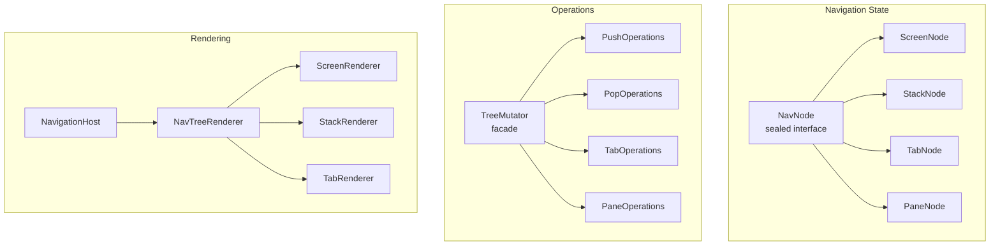

# Quo Vadis — Consolidated Improvements Plan

**Date:** February 5, 2026  
**Scope:** Full library analysis — architecture, Kotlin language usage, performance, API design, KSP code generation  
**Overall Quality Assessment: 8/10** — Production-ready with solid fundamentals. The improvements below would elevate it from good to excellent.

---

## Table of Contents

1. [Executive Summary](#1-executive-summary)
2. [Architecture Analysis](#2-architecture-analysis)
3. [API Design Issues & Recommendations](#3-api-design-issues--recommendations)
4. [Kotlin Language Improvements](#4-kotlin-language-improvements)
5. [Performance Optimizations](#5-performance-optimizations)
6. [Code Generation (KSP) Improvements](#6-code-generation-ksp-improvements)
7. [Testing Improvements](#7-testing-improvements)
8. [Prioritized Improvement Backlog](#8-prioritized-improvement-backlog)
9. [Phased Implementation Plan](#9-phased-implementation-plan)

---

## 1. Executive Summary

Quo Vadis is a sophisticated, type-safe navigation library for Kotlin Multiplatform and Compose Multiplatform. It demonstrates excellent architectural decisions with a tree-based navigation model, immutable state management, and comprehensive KSP code generation.

**Strengths:**
- Immutable tree with structural sharing — the right architectural choice
- Sealed `NavNode` hierarchy — clean and exhaustive, enables compile-time safety
- `TreeMutator` as pure functions — perfect separation, no side effects
- Clean registry interfaces with composite implementations for multi-module support
- Well-designed builder pattern with `@DslMarker`
- Good KSP integration for zero-boilerplate routing

**Areas for improvement:**
- **Architecture**: Duplicated lifecycle code across nodes, `TreeNavigator` god-class tendencies, missing thread-safety guarantees
- **Kotlin Language**: Missing value classes, no use of contracts, no context receivers/parameters, duplicated `when` exhaustive patterns
- **Performance**: Leaked coroutine scopes, redundant tree traversals, unnecessary allocations, suboptimal cache eviction

---

## 2. Architecture Analysis

### 2.1 Core Architecture Overview



### 2.2 Architecture Strengths

| Aspect | Assessment |
|--------|------------|
| Tree-based state model | Excellent. Immutable tree with structural sharing is the right choice |
| Sealed NavNode hierarchy | Clean and exhaustive, enables compile-time safety |
| TreeMutator as pure functions | Perfect separation — no side effects in tree operations |
| Operations decomposition | Good. PushOperations, PopOperations, etc. follow SRP |
| Registry system | Clean interfaces with composite implementations for multi-module |
| DSL configuration | Well-designed builder pattern with `@DslMarker` |
| Annotation processing | Good KSP integration for zero-boilerplate routing |

**Immutable Tree Structure:**
- Structural sharing: unchanged subtrees are reused by reference during navigation operations
- Predictable updates: pure functions with no side effects
- Transaction support: easy comparison of old/new states for animations
- Serialization ready: full `kotlinx.serialization` support for process death survival

**Lifecycle-Aware Design:**
```
Created → attachToNavigator() → Attached → attachToUI() → Displayed
                                    ↑                            ↓
                                    └──── detachFromUI() ────────┘
                                    ↓
                        detachFromNavigator() → Destroyed
```

**Facade Pattern:** `TreeMutator` delegates to specialized operation classes — `PushOperations`, `PopOperations`, `TabOperations`, `PaneOperations`, `BackOperations`.

**Separation of Concerns:** Navigation State (NavNode tree) · Visual Layout (Renderer) · Adaptation Strategy (pane adaptation when space is limited).

### 2.3 Architecture Issues

#### ARCH-1: TreeNavigator is a God Class (1095 lines)

**File:** `navigation/internal/tree/TreeNavigator.kt`

`TreeNavigator` implements `PaneNavigator`, `TransitionController`, and `ResultCapable`, accumulating responsibilities:
- Core navigation (push/pop)
- Container-aware navigation
- Pane-specific operations
- Predictive back gesture handling
- Transition state management
- Lifecycle notification
- Result management coordination
- Deep link handling

**Impact:** Hard to test individual concerns, high cognitive load, change risk.

**Recommendation:** Extract concerns into composable delegates:
```kotlin
class TreeNavigator(
    override val config: NavigationConfig,
    initialState: NavNode? = null
) : Navigator {
    private val stateManager = NavigationStateManager(initialState)
    private val transitionManager = TransitionManager()
    private val lifecycleManager = LifecycleManager()
    private val paneManager = PaneManager(stateManager)
    private val resultManager = NavigationResultManager()
}
```

**Priority:** High

---

#### ARCH-2: Duplicated Lifecycle Implementation Across Nodes

**Files:** `ScreenNode.kt`, `TabNode.kt`, `PaneNode.kt`

All three lifecycle-aware nodes have **identical** lifecycle management code (80+ lines each):
- `isAttachedToNavigator`, `isDisplayed` state tracking
- `onDestroyCallbacks` management
- `attachToNavigator()`, `attachToUI()`, `detachFromUI()`, `detachFromNavigator()`
- `close()` cleanup logic

**Impact:** Violation of DRY, maintenance burden — any lifecycle bug must be fixed in 3 places.

**Recommendation:** Extract to a delegate class:
```kotlin
class LifecycleDelegate : LifecycleAwareNode {
    override var isAttachedToNavigator: Boolean = false; private set
    override var isDisplayed: Boolean = false; private set
    override var composeSavedState: Map<String, List<Any?>>? = null
    private val onDestroyCallbacks = mutableListOf<() -> Unit>()
    
    override fun attachToNavigator() { isAttachedToNavigator = true }
    override fun attachToUI() {
        if (!isAttachedToNavigator) attachToNavigator()
        isDisplayed = true
    }
    override fun detachFromUI() {
        isDisplayed = false
        if (!isAttachedToNavigator) close()
    }
    override fun detachFromNavigator() {
        isAttachedToNavigator = false
        if (!isDisplayed) close()
    }
    override fun addOnDestroyCallback(callback: () -> Unit) { onDestroyCallbacks.add(callback) }
    override fun removeOnDestroyCallback(callback: () -> Unit) { onDestroyCallbacks.remove(callback) }
    private fun close() {
        onDestroyCallbacks.forEach { it.invoke() }
        onDestroyCallbacks.clear()
    }
}

// Usage via Kotlin delegation:
class ScreenNode(...) : NavNode, LifecycleAwareNode by LifecycleDelegate()
```

**Priority:** High

---

#### ARCH-3: ScreenNode Can't Be a Data Class (Mutable Runtime State)

**File:** `ScreenNode.kt`

`ScreenNode` is a regular class with manual `copy()`, `equals()`, `hashCode()`, and `toString()` implementations because it has mutable transient lifecycle state. This is error-prone.

**Impact:** Manual implementations can drift; they already exclude transient state but must be maintained manually.

**Recommendation:** With the lifecycle delegate (ARCH-2), `ScreenNode` could become a data class again, since all mutable state lives in the delegate. Only the `NavigationDelegate` reference would need to be `@Transient`.

**Priority:** Medium (depends on ARCH-2)

---

#### ARCH-4: Duplicated Tree Traversal Patterns

**Files:** `TreeNavigator.kt`, `NavNode.kt`

The same recursive `when` pattern over `NavNode` types is repeated 6+ times in `TreeNavigator` alone (`collectScreenKeysRecursive`, `collectLifecycleAwareNodesRecursive`, `collectLifecycleAwareNodeKeysRecursive`) and also in `NavNode.kt` extension functions (`allScreens`, `allTabNodes`, `allStackNodes`, `allPaneNodes`, `nodeCount`, `depth`).

**Recommendation:** Create a generic tree visitor/fold:
```kotlin
inline fun <R> NavNode.fold(
    initial: R,
    crossinline combine: (R, R) -> R,
    crossinline transform: (NavNode) -> R
): R {
    val current = transform(this)
    return when (this) {
        is ScreenNode -> current
        is StackNode -> children.fold(current) { acc, child ->
            combine(acc, child.fold(initial, combine, transform))
        }
        is TabNode -> stacks.fold(current) { acc, stack ->
            combine(acc, stack.fold(initial, combine, transform))
        }
        is PaneNode -> paneConfigurations.values.fold(current) { acc, config ->
            combine(acc, config.content.fold(initial, combine, transform))
        }
    }
}

// Usage:
fun NavNode.allScreens() = fold(emptyList<ScreenNode>(), List<ScreenNode>::plus) {
    if (it is ScreenNode) listOf(it) else emptyList()
}
```

**Priority:** Medium

---

#### ARCH-5: No Thread Safety in State Updates

**File:** `TreeNavigator.kt`

State updates (`_state.value = newState`) are performed directly without synchronization. While `StateFlow` is thread-safe for reads, concurrent `navigate()` calls from different threads/coroutines could cause lost updates:

```kotlin
// Thread A reads state, computes new state
val oldState = _state.value        // Thread A
val newStateA = TreeMutator.push(oldState, destA) // Thread A

// Thread B reads SAME old state, computes new state
val oldStateB = _state.value       // Thread B — same as oldState!
val newStateB = TreeMutator.push(oldStateB, destB) // Thread B

// Thread A writes first, Thread B overwrites — Thread A's navigation lost!
_state.value = newStateA           // Thread A
_state.value = newStateB           // Thread B — destA is lost!
```

**Recommendation:** Use `MutableStateFlow.update { }` with CAS (compare-and-swap) or a `Mutex` for atomic updates.

**Priority:** High

---

#### ARCH-6: BackResult Should Be a Sealed Interface

**File:** `navigation/internal/tree/result/BackResult.kt`

`BackResult` is declared as `sealed class` but should be `sealed interface` since it has no state or behavior of its own.

**Priority:** Low

---

#### ARCH-7: Missing Error Handling Strategy

**File:** `TreeNavigator.kt`

Errors in navigation operations are handled inconsistently:
- `navigateDefault`: catches `IllegalStateException` and creates a fallback root stack (silent recovery)
- `navigateWithContainer`: catches `IllegalStateException` with separate fallback
- `clearPane`: throws `IllegalStateException` directly

Navigation failures should have a consistent strategy — either a sealed `NavigationResult` return type or a configurable error handler.

**Priority:** Medium

---

#### ARCH-8: Registry System Consolidation

**Current State:** Multiple registry interfaces (`ScreenRegistry`, `ContainerRegistry`, `TransitionRegistry`, etc.) with composite implementations.

**Recommendation:** Consider a unified registry approach using type-safe accessors:

```kotlin
class NavigationRegistry {
    private val screens = mutableMapOf<KClass<*>, @Composable (NavDestination) -> Unit>()
    
    inline fun <reified D : NavDestination> register(
        noinline content: @Composable (D) -> Unit
    ) {
        screens[D::class] = content as @Composable (NavDestination) -> Unit
    }
    
    @Composable
    inline fun <reified D : NavDestination> Content(destination: D) {
        val renderer = screens[D::class] 
            ?: error("No screen registered for ${D::class}")
        renderer(destination)
    }
}
```

**Priority:** Low

---

## 3. API Design Issues & Recommendations

### 3.1 Current API Issues

#### API-1: `updateState()` Exposed on Navigator Interface

Any consumer with `Navigator` access can call `updateState()` to set arbitrary state. This bypasses all validation, lifecycle management, and scoping. Should be moved to an internal interface or at minimum deprecated in favor of the high-level methods.

**Priority:** Medium

---

#### API-2: Mutable `var` Properties on TreeNavigator

`backHandlerRegistry` and `windowSizeClass` are public mutable `var` properties. They should be settable only from the navigation host, not from any consumer.

**Priority:** Low

---

### 3.2 Navigator Interface Refinement

**Current:** Basic Navigator interface with `StateFlow` properties.

**Recommended:** Add coroutine-based navigation flows and result handling:

```kotlin
interface Navigator {
    val state: StateFlow<NavNode>
    val currentDestination: StateFlow<NavDestination?>
    val canNavigateBack: StateFlow<Boolean>
    
    fun navigate(destination: NavDestination)
    fun navigateBack(): Boolean
    
    // Async navigation with results
    suspend fun <T> navigateForResult(destination: ReturnsResult<T>): T?
    suspend fun navigateWithAnimation(
        destination: NavDestination, 
        transition: NavTransition
    ): NavigationResult
    
    // Navigation events for reactive patterns (analytics, logging)
    val navigationEvents: SharedFlow<NavigationEvent>
}

sealed class NavigationEvent {
    data class Push(val destination: NavDestination) : NavigationEvent()
    data class Pop(val from: NavDestination, val to: NavDestination?) : NavigationEvent()
    data class Replace(val from: NavDestination, val to: NavDestination) : NavigationEvent()
}
```

**Priority:** Medium

---

### 3.3 Consolidated Navigation State

**Current:** Multiple separate `StateFlow` properties.

**Recommended:** Use data class for atomic state updates:

```kotlin
data class NavigationState(
    val root: NavNode,
    val currentDestination: NavDestination?,
    val canNavigateBack: Boolean,
    val isNavigating: Boolean
)

interface Navigator {
    val state: StateFlow<NavigationState>
    
    val root: StateFlow<NavNode> 
        get() = state.map { it.root }.distinctUntilChanged()
}
```

**Priority:** Medium

---

### 3.4 Type-Safe Navigation Result Handling

```kotlin
sealed class NavigationResult<out T> {
    data class Success<T>(val data: T) : NavigationResult<T>()
    data class Cancelled(val reason: String?) : NavigationResult<Nothing>()
    data class Error(val exception: Throwable) : NavigationResult<Nothing>()
}

val result = navigator.navigateForResult(ItemPicker) { item -> item.isAvailable }
when (result) {
    is NavigationResult.Success -> displayItem(result.data)
    is NavigationResult.Cancelled -> showCancelledMessage()
    is NavigationResult.Error -> showError(result.exception)
}
```

**Priority:** Low

---

### 3.5 Configuration DSL Enhancement

**Future Enhancement:** Leverage Kotlin's context receivers (once stable) for even more type-safe DSL:

```kotlin
context(NavigationConfigBuilder)
inline fun <reified S : NavDestination> stack(
    start: KClass<S>,
    block: StackBuilder.() -> Unit
) { /* type-safe constraints */ }

navigationConfig {
    stack<HomeDestination> {
        screen<DetailDestination>()
        screen<SettingsDestination>()
    }
}
```

**Priority:** Low (future)

---

## 4. Kotlin Language Improvements

### 4.1 Excellent Current Usage

- **Sealed Interface Hierarchy**: Perfect use for `NavNode` hierarchy enabling exhaustive `when` expressions
- **Reified Generics**: Excellent use in DSL builders (`inline fun <reified D : NavDestination> screen(...)`)
- **@DslMarker**: Proper use of `@NavigationConfigDsl` preventing scope leakage

### 4.2 Value Classes for Type Safety

#### KOTLIN-1: Node Keys as Value Classes

**Files:** All NavNode types, TreeNavigator, TreeMutator, all operations

```kotlin
@JvmInline
value class NodeKey(val value: String) {
    companion object {
        @OptIn(ExperimentalUuidApi::class)
        fun random(): NodeKey = NodeKey(Uuid.random().toString().take(8))
    }
}
```

**Benefits:** Can't accidentally pass a route string where a key is expected, self-documenting parameter types, zero overhead.  
**Impact:** Broad but mechanical refactor.  
**Priority:** Medium

---

#### KOTLIN-2: Scope Key as Value Class

**Files:** `StackNode.kt`, `TabNode.kt`, `PaneNode.kt`, `ScopeRegistry.kt`

```kotlin
@JvmInline
value class ScopeKey(val value: String)
```

**Priority:** Low

---

### 4.3 Contracts

#### KOTLIN-3: Add Contracts to Extension Functions

**File:** `NavNode.kt` extension functions

```kotlin
fun NavNode.requireStack(): StackNode {
    contract { returns() implies (this@requireStack is StackNode) }
    return this as? StackNode ?: error("Expected StackNode, got ${this::class.simpleName}")
}
```

**Priority:** Low

---

### 4.4 Context Parameters (Kotlin 2.2+)

#### KOTLIN-4: Context Parameters for Key Generation

Currently, `generateKey: () -> String` is passed through every operation. With Kotlin 2.2 context parameters:

```kotlin
context(keyGenerator: KeyGenerator)
fun PushOperations.push(root: NavNode, destination: NavDestination): NavNode {
    val screenKey = keyGenerator.generate()
}
```

**Note:** Experimental in Kotlin 2.2. Evaluate stability before adopting.  
**Priority:** Low (future consideration)

---

### 4.5 Inline Functions

#### KOTLIN-5: Inline Tree Traversal Lambdas

**Files:** `NavNode.kt`, `TreeNodeOperations.kt`

Functions like `popTo(root, inclusive, predicate)` accept lambda predicates. Making them `inline` avoids lambda allocation on each call. This is already done for `popToDestination` (`inline fun <reified D>`) but not for `popTo` with predicate.

**Priority:** Medium

---

### 4.6 Sealed Interface vs Sealed Class

#### KOTLIN-6: Prefer Sealed Interfaces

**Files:** `BackResult`, `ContainerInfo`, `PopResult`, `PushStrategy`

Sealed interfaces are more flexible (allow multiple inheritance) and are the modern Kotlin convention for algebraic data types without shared state.

**Priority:** Low

---

### 4.7 TransitionState Active Interface

#### KOTLIN-8: Replace Chained when Branches

**File:** `TreeNavigator.kt` — `updateTransitionProgress()`

```kotlin
// Current — repeats .copy(progress = progress) for 3 branches:
_transitionState.value = when (current) {
    is TransitionState.Idle -> current
    is TransitionState.InProgress -> current.copy(progress = progress)
    is TransitionState.PredictiveBack -> current.copy(progress = progress)
    is TransitionState.Seeking -> current.copy(progress = progress)
}

// Recommended — common Active interface:
sealed interface TransitionState {
    data object Idle : TransitionState
    sealed interface Active : TransitionState {
        val progress: Float
        fun withProgress(progress: Float): Active
    }
}

// Then:
_transitionState.value = when (val current = _transitionState.value) {
    is TransitionState.Idle -> current
    is TransitionState.Active -> current.withProgress(progress)
}
```

**Priority:** Low

---

### 4.8 Type Aliases for Common Callback Types

#### KOTLIN-9: Type Aliases

```kotlin
typealias NavKeyGenerator = () -> String
typealias OnDestroyCallback = () -> Unit
typealias NavTransitionProvider = (NavDestination) -> NavigationTransition?
```

**Priority:** Low

---

### 4.9 Result Type for Failable Operations

#### KOTLIN-10: Sealed Result Types Instead of Exceptions

**File:** `TreeNodeOperations.kt`

`replaceNode` and `removeNode` throw `IllegalArgumentException` when a node key is not found. Sealed results are more Kotlin-idiomatic and testable:

```kotlin
sealed interface TreeOperationResult {
    data class Success(val newTree: NavNode) : TreeOperationResult
    data class NodeNotFound(val key: String) : TreeOperationResult
    data class OperationNotAllowed(val reason: String) : TreeOperationResult
}
```

Since these are `@InternalQuoVadisApi` functions, exceptions may be acceptable for fail-fast behavior.  
**Priority:** Low

---

### 4.10 Opt-In Annotations Management

**Current:** Multiple `@OptIn` annotations scattered throughout code.

**Recommended:** Centralize:
```kotlin
@OptIn(
    ExperimentalUuidApi::class,
    ExperimentalComposeUiApi::class,
    ExperimentalSharedTransitionApi::class
)
@RequiresOptIn("Internal Quo Vadis API")
annotation class InternalQuoVadisApi
```

**Priority:** Low

---

### 4.11 DSL Marker Verification

#### KOTLIN-7: Verify @DslMarker Usage

Verify that all DSL builder classes (`StackBuilder`, `TabsBuilder`, `PanesBuilder`, etc.) are properly annotated with `@DslMarker` to prevent accidental receiver leaking.

**Priority:** Low

---

## 5. Performance Optimizations

### 5.1 Critical Performance Issues

#### PERF-1: Leaked CoroutineScope in cancelResultsForDestroyedScreens

**File:** `TreeNavigator.kt`

```kotlin
private fun cancelResultsForDestroyedScreens(oldState: NavNode, newState: NavNode) {
    val coroutineScope = CoroutineScope(SupervisorJob() + Dispatchers.Default)
    coroutineScope.launch {
        destroyedKeys.forEach { screenKey -> resultManager.cancelResult(screenKey) }
        coroutineScope.cancel() // Self-cancellation inside the scope — code smell
    }
}
```

**Issues:**
1. Creates a **new CoroutineScope on every state change** with destroyed screens
2. Self-cancellation from within the scope
3. `try-catch` for `IllegalStateException` silently swallows errors

**Recommendation:** Use a single scope owned by TreeNavigator:
```kotlin
private val navigatorScope = CoroutineScope(SupervisorJob() + Dispatchers.Main.immediate)

private fun cancelResultsForDestroyedScreens(oldState: NavNode, newState: NavNode) {
    val destroyedKeys = collectScreenKeys(oldState) - collectScreenKeys(newState)
    if (destroyedKeys.isEmpty()) return
    navigatorScope.launch {
        destroyedKeys.forEach { resultManager.cancelResult(it) }
    }
}
```

**Priority:** Critical

---

#### PERF-2: Leaked CoroutineScope in currentTransition

**File:** `TreeNavigator.kt`

```kotlin
override val currentTransition: StateFlow<NavigationTransition?> = _transitionState
    .map { ... }
    .stateIn(
        scope = CoroutineScope(SupervisorJob() + Dispatchers.Main.immediate), // LEAK!
        started = SharingStarted.WhileSubscribed(5000),
        initialValue = null
    )
```

A new `CoroutineScope` is created inline and **never cancelled**.

**Recommendation:** Use the shared `navigatorScope` and add a `destroy()` method for cleanup.

**Priority:** Critical

---

#### PERF-3: Redundant Tree Traversals on Every State Update

**File:** `TreeNavigator.kt`

`updateStateWithTransition()` triggers **at least 6 tree traversals**:
1. `updateDerivedState(newState)` → `activeLeaf()` + `computePreviousDestination()` + `canHandleBackNavigation()`
2. `notifyRemovedNodesDetached(oldState, newState)` → Traverses old + new tree
3. `cancelResultsForDestroyedScreens(oldState, newState)` → Traverses old + new tree again

**Recommendation:** Combine traversals into a single pass:
```kotlin
data class TreeDiff(
    val activeLeaf: ScreenNode?,
    val previousDestination: NavDestination?,
    val canNavigateBack: Boolean,
    val removedLifecycleNodes: List<NavNode>,
    val removedScreenKeys: Set<String>
)

private fun computeTreeDiff(oldState: NavNode, newState: NavNode): TreeDiff {
    val oldKeys = mutableMapOf<String, NavNode>()
    collectAllNodes(oldState, oldKeys)
    val newKeys = mutableSetOf<String>()
    val activeLeaf = collectKeysAndFindLeaf(newState, newKeys)
    val removedNodes = oldKeys.filterKeys { it !in newKeys }
    // ...
}
```

**Priority:** High

---

#### PERF-4: List Allocation in Tree Operations

**File:** `NavNode.kt` extension functions

`allScreens()`, `allTabNodes()`, etc. create intermediate lists through `flatMap`.

**Recommendation:** Accumulator pattern:
```kotlin
fun NavNode.allScreens(): List<ScreenNode> = buildList { collectScreens(this@allScreens) }

private fun MutableList<ScreenNode>.collectScreens(node: NavNode) {
    when (node) {
        is ScreenNode -> add(node)
        is StackNode -> node.children.forEach { collectScreens(it) }
        is TabNode -> node.stacks.forEach { collectScreens(it) }
        is PaneNode -> node.paneConfigurations.values.forEach { collectScreens(it.content) }
    }
}
```

**Priority:** Medium

---

#### PERF-5: findByKey Linear Scan / Double Traversal

**File:** `NavNode.kt`, `TreeNodeOperations.kt`

`replaceNode` calls `child.findByKey(targetKey) != null` (first traversal), then calls `replaceNode(child, ...)` which searches the subtree again (second traversal).

**Recommendation:** Combined find-and-replace in a single traversal:
```kotlin
fun replaceNode(root: NavNode, targetKey: String, newNode: NavNode): NavNode? {
    if (root.key == targetKey) return newNode
    return when (root) {
        is ScreenNode -> null
        is StackNode -> {
            var found = false
            val newChildren = root.children.map { child ->
                if (!found) {
                    val result = replaceNode(child, targetKey, newNode)
                    if (result != null) { found = true; result } else child
                } else child
            }
            if (found) root.copy(children = newChildren) else null
        }
        // ... similar for TabNode, PaneNode
    }
}
```

**Priority:** Medium

---

#### PERF-6: UUID Key Generation Overhead

**File:** `TreeNavigator.kt`, `KeyGenerator.kt`

`Uuid.random().toString().take(8)` generates a full UUID string (36 chars), then takes only 8 characters.

**Recommendation:** `kotlin.random.Random.nextLong().toULong().toString(36)` avoids UUID overhead entirely.

**Priority:** Low

---

#### PERF-7: ComposableCache Eviction During Composition

**File:** `ComposableCache.kt`

Cache eviction happens inside `DisposableEffect` during composition:

**Issues:**
1. `removeState` during composition could cause cascading recompositions
2. Linear scan (`filter` + `minByOrNull`) on every entry composition
3. `counter` is a simple `Long` — not atomic, could mismatch in concurrent compositions

**Recommendation:** Defer eviction to `SideEffect`, use `LinkedHashMap` for O(1) LRU eviction, use `AtomicLong` for the counter.

**Priority:** Medium

---

#### PERF-8: NavigationResultManager Thread Safety Inconsistency

**File:** `NavigationResultManager.kt`

`cancelResult()` uses `Mutex` but `requestResult()` and `completeResultSync()` access `pendingResults` without synchronization.

**Recommendation:** Use `ConcurrentHashMap` or apply `Mutex` consistently for all operations.

**Priority:** Medium

---

### 5.2 Compose-Specific Optimizations

#### PERF-9: Unstable Lambda Parameters in Navigation DSL

Verify that all composable lambdas passed through the registry and renderers are stable or wrapped in `remember`.

**Priority:** Low (needs profiling)

---

#### PERF-10: Derived State for canNavigateBack

`canNavigateBack` is a separate `MutableStateFlow` that's manually updated. Since it's derived from `state`, it could use `state.map { ... }.stateIn(...)` to avoid manual synchronization.

**Priority:** Low

---

### 5.3 Memory Optimizations

#### MEM-1: WeakReference for Callbacks

**Current:** Direct callback storage in lists.

**Recommended:** Use `WeakReference` to prevent memory leaks:
```kotlin
private val onDestroyCallbacks = CopyOnWriteArrayList<WeakReference<() -> Unit>>()
```

**Priority:** Low

---

#### MEM-2: Lazy Initialization of Transient Fields

**Current:** Eager initialization of `@Transient` fields.

**Recommended:**
```kotlin
@Transient
private val _onDestroyCallbacks by lazy { mutableListOf<() -> Unit>() }
```

**Priority:** Low

---

### 5.4 Tree Traversal Optimization — Path Caching

**Recommended:** Add indexed lookups for large trees:

```kotlin
class NavigationTreeIndex(root: NavNode) {
    private val keyToPath = mutableMapOf<String, List<String>>()
    private val pathCache = mutableMapOf<String, NavNode>()
    
    fun findByKey(key: String): NavNode? {
        return pathCache.getOrPut(key) {
            val path = keyToPath[key] ?: return null
            traversePath(root, path)
        }
    }
    
    fun invalidatePath(key: String) { pathCache.remove(key) }
}
```

**Priority:** Low

---

### 5.5 Render Scope Pooling

```kotlin
class RenderScopePool {
    private val pool = ArrayDeque<NavRenderScope>(10)
    
    fun acquire(): NavRenderScope = pool.removeFirstOrNull() ?: createNewScope()
    fun release(scope: NavRenderScope) {
        scope.clear()
        if (pool.size < 10) pool.addLast(scope)
    }
}
```

**Priority:** Low

---

## 6. Code Generation (KSP) Improvements

### 6.1 Current Strengths

- Clear phase separation: Collection → Validation → Generation
- Proper originating file tracking for incremental compilation
- Multi-round processing support with `hasGenerated` flag

### 6.2 Enhancement Opportunities

#### KSP-1: Code Generation Caching

Cache parsed symbol information between rounds:

```kotlin
class QuoVadisSymbolProcessor {
    private val classDeclarationCache = mutableMapOf<String, KSClassDeclaration?>()
    
    private fun getClassDeclaration(qualifiedName: String): KSClassDeclaration? {
        return classDeclarationCache.getOrPut(qualifiedName) {
            resolver.getClassDeclarationByName(qualifiedName)
        }
    }
}
```

**Priority:** Low

---

#### KSP-2: Parallel Processing

Process independent symbols in parallel:

```kotlin
val stackInfos = resolver.getSymbolsWithAnnotation(Stack::class.qualifiedName!!)
    .filterIsInstance<KSClassDeclaration>()
    .toList()
    .parallelStream()
    .map { extractStackInfo(it) }
    .toList()
    .filterNotNull()
```

**Priority:** Low

---

#### KSP-3: Incremental Generation

**Current:** Regenerates all code on any change.

**Recommended:** Generate incremental updates — only regenerate affected parts.

**Priority:** Low

---

## 7. Testing Improvements

### 7.1 Test DSL

```kotlin
@Test
fun `navigation back from detail returns to list`() = runNavigationTest {
    navigateTo(DetailDestination(itemId = "123"))
    navigateBack()
    
    assertCurrentDestinationIs<ListDestination>()
    assertBackStackSize(1)
}
```

**Priority:** Medium

---

### 7.2 Snapshot Testing Support

```kotlin
@Test
fun `navigation tree structure`() {
    val navigator = createNavigator()
    navigator.push(HomeDestination)
    navigator.push(DetailDestination)
    
    assertSnapshot(navigator.state.value) {
        // Generate readable tree representation
    }
}
```

**Priority:** Low

---

## 8. Prioritized Improvement Backlog

| ID | Title | Area | Priority | Effort |
|----|-------|------|----------|--------|
| PERF-1 | Fix leaked CoroutineScope in cancelResults | Performance | **Critical** | Small |
| PERF-2 | Fix leaked CoroutineScope in currentTransition | Performance | **Critical** | Small |
| ARCH-5 | Thread-safe state mutations | Architecture | **High** | Medium |
| PERF-3 | Combine redundant tree traversals | Performance | **High** | Medium |
| ARCH-1 | Extract TreeNavigator delegates | Architecture | **High** | Large |
| ARCH-2 | Extract lifecycle delegate | Architecture | **High** | Medium |
| PERF-8 | Fix ResultManager thread safety | Performance | **Medium** | Small |
| PERF-4 | Eliminate intermediate list allocations | Performance | **Medium** | Small |
| PERF-5 | Optimize replaceNode double traversal | Performance | **Medium** | Small |
| KOTLIN-5 | Inline tree traversal lambdas | Kotlin | **Medium** | Small |
| PERF-7 | Fix cache eviction during composition | Performance | **Medium** | Medium |
| ARCH-4 | Generic tree visitor/fold | Architecture | **Medium** | Medium |
| ARCH-7 | Consistent error handling strategy | Architecture | **Medium** | Medium |
| API-1 | Restrict updateState visibility | API | **Medium** | Small |
| KOTLIN-1 | Value class for NodeKey | Kotlin | **Medium** | Large |
| ARCH-3 | ScreenNode as data class (after ARCH-2) | Architecture | **Medium** | Small |
| TEST-1 | Navigation test DSL | Testing | **Medium** | Medium |
| KOTLIN-6 | Sealed interfaces for ADTs | Kotlin | **Low** | Small |
| KOTLIN-8 | TransitionState.Active interface | Kotlin | **Low** | Small |
| KOTLIN-9 | Type aliases for callbacks | Kotlin | **Low** | Small |
| PERF-6 | Optimize key generation | Performance | **Low** | Small |
| API-2 | Restrict mutable properties | API | **Low** | Small |
| ARCH-6 | BackResult as sealed interface | Architecture | **Low** | Small |
| ARCH-8 | Registry system consolidation | Architecture | **Low** | Large |
| KOTLIN-2 | Value class for ScopeKey | Kotlin | **Low** | Small |
| KOTLIN-3 | Add contracts | Kotlin | **Low** | Medium |
| KOTLIN-4 | Context parameters (future) | Kotlin | **Low** | Large |
| KOTLIN-7 | Verify DslMarker usage | Kotlin | **Low** | Small |
| KOTLIN-10 | Sealed results for tree ops | Kotlin | **Low** | Medium |
| KSP-1 | Code generation caching | KSP | **Low** | Small |
| KSP-2 | Parallel KSP processing | KSP | **Low** | Medium |
| KSP-3 | Incremental generation | KSP | **Low** | Large |
| TEST-2 | Snapshot testing support | Testing | **Low** | Medium |
| MEM-1 | WeakReference for callbacks | Memory | **Low** | Small |
| MEM-2 | Lazy initialization of transient fields | Memory | **Low** | Small |

---

## 9. Phased Implementation Plan

### Phase 1: Critical Fixes (Immediate — 1 day)

| Task | Effort |
|------|--------|
| **PERF-1 + PERF-2**: Fix leaked `CoroutineScope` instances — create shared `navigatorScope`, add `destroy()` | 1-2 hours |
| **ARCH-5**: Thread-safe state mutations — use `_state.update { }` or `Mutex` | 2-3 hours |

### Phase 2: Architecture Cleanup (1-2 weeks)

| Task | Effort |
|------|--------|
| **ARCH-2**: Extract `LifecycleDelegate` — refactor `ScreenNode`, `TabNode`, `PaneNode` to use delegation | 4-6 hours |
| **ARCH-3**: Convert `ScreenNode` to data class (after ARCH-2) | 1-2 hours |
| **ARCH-1**: Extract `TreeNavigator` responsibilities — create `TransitionManager`, `LifecycleNotifier`, `PaneNavigatorDelegate` | 1-2 days |
| **PERF-3**: Combine tree traversals — single-pass diffing for lifecycle and result cancellation | 4-6 hours |

### Phase 3: Performance & Polish (1-2 weeks)

| Task | Effort |
|------|--------|
| **PERF-4 + PERF-5**: Allocation optimization — accumulator pattern, combined find-and-replace | 3-4 hours |
| **PERF-7**: ComposableCache improvements — defer eviction to SideEffect, LinkedHashMap for O(1) LRU | 2-3 hours |
| **PERF-8**: NavigationResultManager thread safety — consistent synchronization | 1 hour |
| **ARCH-7**: Consistent error handling strategy | 3-4 hours |
| **TEST-1**: Navigation test DSL | 4-6 hours |

### Phase 4: Kotlin Modernization (Ongoing)

| Task | Effort |
|------|--------|
| **KOTLIN-1**: Value classes for keys | 1-2 days |
| **KOTLIN-5**: Inline critical lambdas | 2-3 hours |
| **KOTLIN-6**: Sealed interfaces | 1 hour |
| **ARCH-4**: Generic tree fold utility | 3-4 hours |
| **API-1**: Restrict `updateState` visibility | 1-2 hours |

### Appendix: Files Affected by Priority

| Priority | Files |
|----------|-------|
| **Critical** | `TreeNavigator.kt` — scopes, thread safety |
| **High** | `ScreenNode.kt`, `TabNode.kt`, `PaneNode.kt` — lifecycle delegation · `TreeNavigator.kt` — responsibility extraction · `NavNode.kt` — traversal optimization |
| **Medium** | `TreeNodeOperations.kt` — double traversal · `ComposableCache.kt` — eviction strategy · `NavigationResultManager.kt` — thread safety · `BackResult.kt`, `ContainerInfo` — sealed interfaces |
| **Low** | `KeyGenerator.kt` — generation efficiency · DSL builders — DslMarker verification · All node types — value classes for keys |

---

*Consolidated from two independent analyses conducted on the codebase as of February 2026.*
